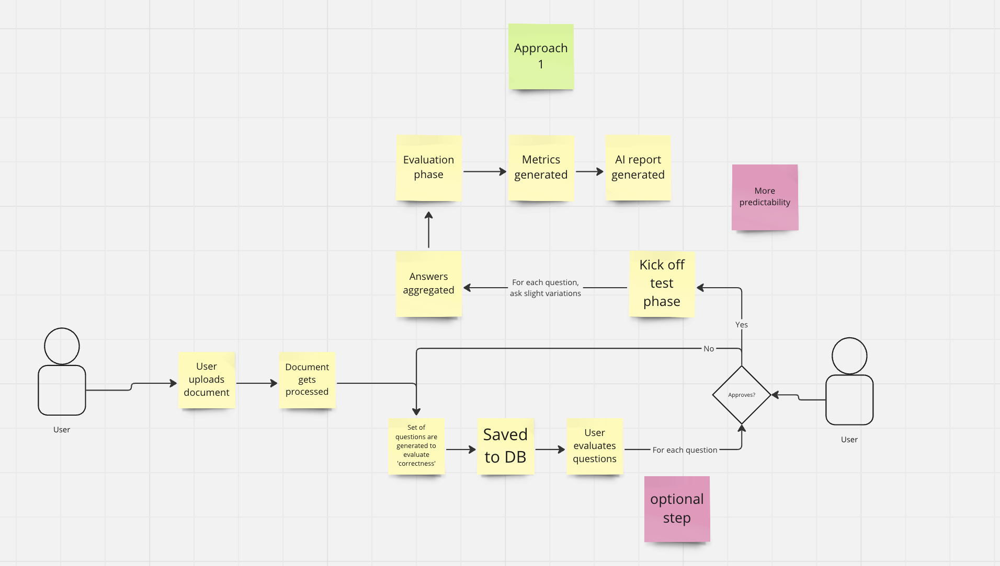
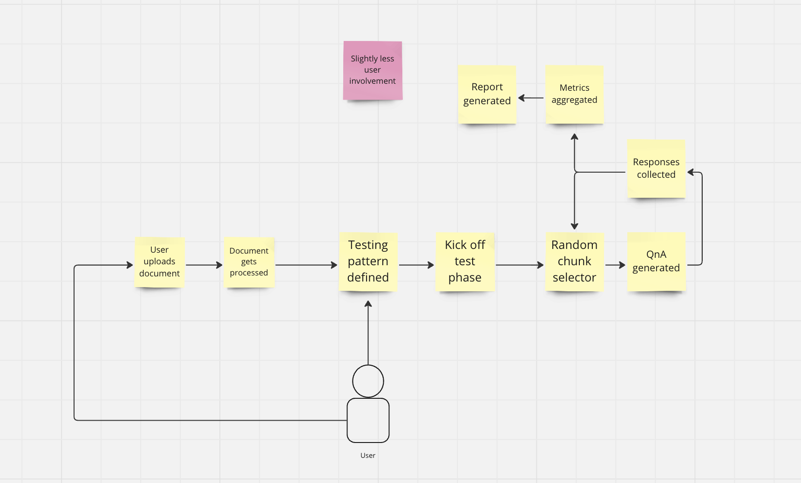

# MAIHEM POC app
We are developing a SaaS platform that simulates users (AI personas) to test our customers' AI applications (e.g., a mental health care chatbot). We would like you to create a proof of concept (POC) of our platform and present your solution during our next interview call. A POC is a rough prototype used to demonstrate the feasibility of an idea — it is usually small and may or may not be complete. The POC has the following requirements:

* Our customers will need to access the platform through an API endpoint
* Our API application should be hosted on the cloud (please use a cloud provider of your choice)
* An open-source LLM (of your choice) needs to be implemented to simulate the users (AI personas) that will test the customer’s chatbot.
* There are 2 chatbots that need to be tested.
* The role of the chatbots is question answering, based on these documents (link to document). 
* The chatbots can be accessed through an API with the following endpoints (link to API instructions).
* The performance of the question-answering chatbots needs to be assessed, using the metrics of your choice.

Optional/Nice-to-have
* Basic frontend to visualise results
 

# Tracker

*04-07-2024 5pm*: Started project

*04-07-2024 6pm*: Finalised architecture design options
#### Option 1

#### Option 2

*04-07-2024 11pm*: Finished some initial set up, research and created boilerplate app.

# To Do
- [ ] Create data processing module
- [ ] Question generator
- [ ] Test runner
- [ ] Metrics
